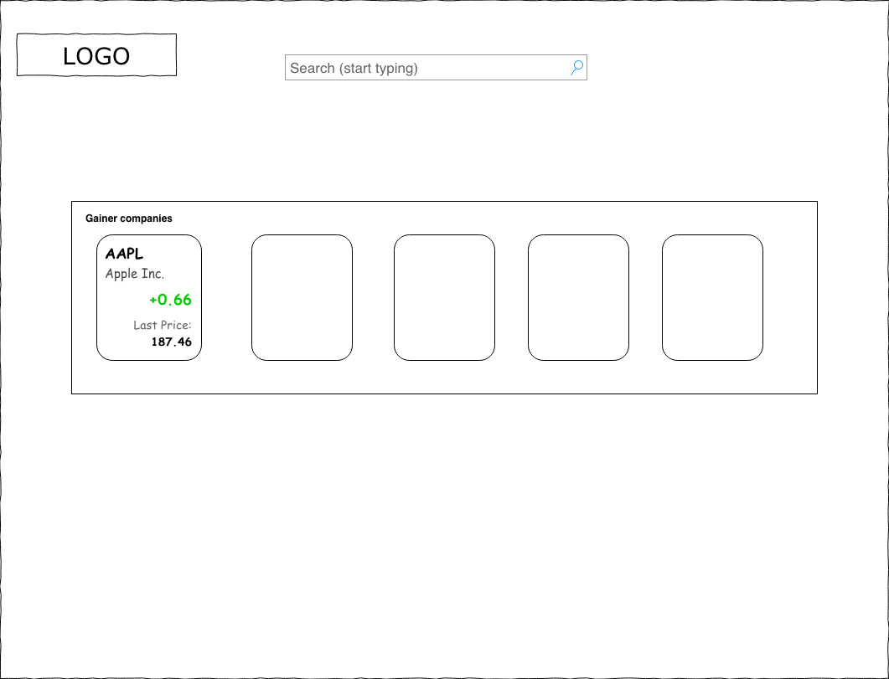
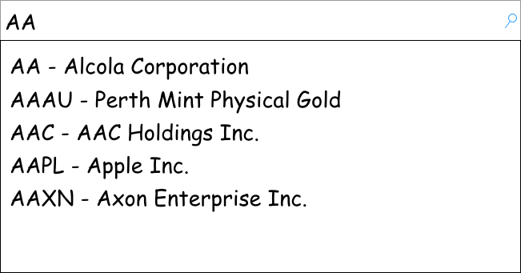
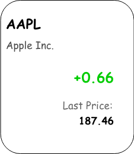
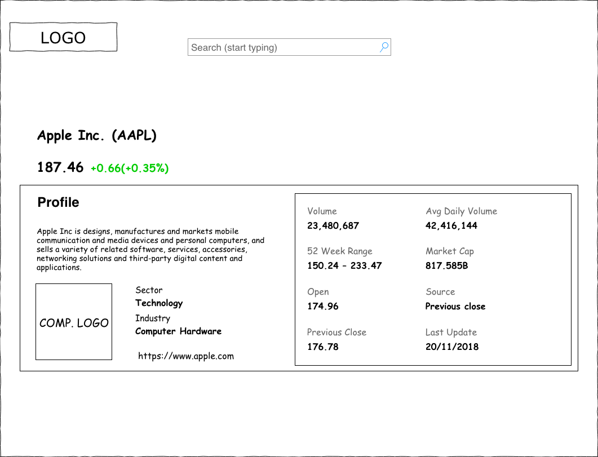

# Hiring event 🎉

## Table of Contents

* [Application](#stock-app)
  * [Requirements](#requirements)
  * [Workflows](#workflows)
    * [Home page](#1-home-page)
    * [Search input](#11-search-input)
    * [Company card](#12-company-card)
    * [Company page](#2-company-details-page)
  * [Evaluation](#evaluation)
* [Where to get data from?](#where-to-get-data-from)
* [Browser Support](#browser-support)
* [FAQ](#faq)
* [Useful scripts](#useful-scripts)
* [Hints](#hints)

## Stock app

You gonna build a SPA application (using Angular framework) which will communicate with open IEX Trading API and help user get some data about companies.

### Requirements

* should use Angular framework (currently it's version 7) with [@angular/cli](https://cli.angular.io/)
* data should be gathered from [`IEX Trading API`](https://iextrading.com/developer/docs/)
* all requests and async actions should be done via RxJS
* for navigation between pages use `@angular/router` (or any preferred)
* every async interaction with a API should be indicated by showing user a loading spinner
* you are free to use any styling framework
* app should be responsive with at least 2 media break points
* tests are optional (but is plus)
* default commands from [@angular/cli](https://cli.angular.io/) should not be modified, as them will be used for project evaluation.

### Workflows

#### 1. Home page

##### Route: `/`

* User should be able to view:
  * website logo on the top left, you can use any logo or [this one](https://upload.wikimedia.org/wikipedia/commons/thumb/7/71/Paw_(Animal_Rights_symbol).svg/1024px-Paw_(Animal_Rights_symbol).svg.png)
  * search input with a placeholder on the top
  * list of 5 gainer companies in the middle
* By clicking on the website logo use should stay on the same (home) page
* Interaction with Search Input is described in item 1.1
* By clicking on one of the gainer companies cards user should be redirected to selected company's details page

Basic mockup:  


#### 1.1 Search input

* Input should have a proper placeholder to introduce user to it's ability to autocomplete
* All data should be prefetched from `symbols` endpoint, refer to [where to get a data?](#where-to-get-data-from)
* User should be able to type [company ticker symbol](https://en.wikipedia.org/wiki/Ticker_symbol) like (AAPL, GOOG)
* User should be able to use only [ISO Basic Latin Alphabet](https://en.wikipedia.org/wiki/ISO_basic_Latin_alphabet) with such variations:
  * lowercase
  * uppercase
  * mixed lowercase and uppercase
* Search component should show suggestions (like a google autocomplete).
* User should be able to choose a suggested company from the suggestions list (via keyboard or mouse)
* User should be able to go to company details page only by selecting one from the suggestions list
* User should NOT be able to submit search by entering some text and submitting search (via keyboard)
* After choosing a company from the suggestions list user should be redirected to company details page

Basic mockup:  


#### 1.2 Company card

* User should be able to view:
  * `symbol`
  * `company name`
  * `price change`
  * `last price`

Basic mockup:  


#### 2. Company details page

##### Route: `company/{symbol}`

* User should be able to view a header with:
  * `company name`
  * `symbol`
  * `last price`
  * `price change` with additional value in percents
* User should be able to view detailed information about the company in a form of company profile card (see Basic mockup below)

Basic mockup:  


### Evaluation

| Story         | Task         | Points | Criteria                                                                                                                |
|---------------|--------------|--------|-------------------------------------------------------------------------------------------------------------------------|
| Global layout |              |        |                                                                                                                         |
|               | Logo         | 5      | Click will redirect to Landing page                                                                                     |
|               | Search bar   | 25     | 10 points for basic submit and redirect to company page.                                                                |
|               |              |        | 25 points for autosuggest component which show relevant TOP 5                                                           |
|               |              |        |                                                                                                                         |
| Landing page  |              |        |                                                                                                                         |
|               | Responsive   | 5      | Support desktop (1920p) and mobile (360p) breakpoints                                                                   |
|               | Company list | 30     | 20 show list of companies + 10 support click with routing to company page                                               |
|               |              |        |                                                                                                                         |
| Company page  |              |        |                                                                                                                         |
|               | Responsive   | 5      | Support desktop (1920p) and mobile (360p) breakpoints                                                                   |
|               | Company info | 30     | Show all of the fields as on mockup                                                                                     |
|               |              |        |                                                                                                                         |
|               | Total:       | 100    |                                                                                                                         |

### Where to get data from?

This is list of endpoints which You have to use:

* GET all companies symbols `https://api.iextrading.com/1.0/ref-data/symbols`. Example response:

```json
[
    {
        "symbol":"AAPL",
        "name":"Apple Inc.",
        "date":"2018-11-23",
        "isEnabled":true,
        "type":"cs",
        "iexId":"11"
    } // , { ... }
]
```

* GET all gainers `https://api.iextrading.com/1.0/stock/market/list/gainers`. Endpoint returns top 10 gainers, but you can use only 5. [Link to documentation](https://iextrading.com/developer/docs/#list). Example response:

```json
[
  {
      "symbol": "AAPL",
      "companyName": "Apple Inc.",
      "primaryExchange": "Nasdaq Global Select",
      "sector": "Technology",
      "calculationPrice": "tops",
      "latestPrice": 187.46,
      "latestSource": "Previous close",
      "latestTime": "September 19, 2017",
      "latestUpdate": 1505779200000,
      "latestVolume": 20567140,
      "iexRealtimePrice": 158.71,
      "iexRealtimeSize": 100,
      "iexLastUpdated": 1505851198059,
      "delayedPrice": 158.71,
      "delayedPriceTime": 1505854782437,
      "previousClose": 158.73,
      "change": 0.66,
      "changePercent": -0.01158,
      "iexMarketPercent": 0.00948,
      "iexVolume": 82451,
      "avgTotalVolume": 29623234,
      "iexBidPrice": 153.01,
      "iexBidSize": 100,
      "iexAskPrice": 158.66,
      "iexAskSize": 100,
      "marketCap": 751627174400,
      "peRatio": 16.86,
      "week52High": 159.65,
      "week52Low": 93.63,
      "ytdChange": 0.3665,
  } // , { ... }
]
```

* Get company basic description `https://api.iextrading.com/1.0/stock/${symbol}/company` [Link to documentation](https://iextrading.com/developer/docs/#company). Example response:

```json
{
  "symbol": "AAPL",
  "companyName": "Apple Inc.",
  "exchange": "Nasdaq Global Select",
  "industry": "Computer Hardware",
  "website": "http://www.apple.com",
  "description": "Apple Inc is an American multinational technology company. It designs, manufactures, and markets mobile communication and media devices, personal computers, and portable digital music players.",
  "CEO": "Timothy D. Cook",
  "issueType": "cs",
  "sector": "Technology",
  "tags": [
      "Technology",
      "Consumer Electronics",
      "Computer Hardware"
  ]
}
```

* Get company logo `https://api.iextrading.com/1.0/stock/${symbol}/logo` [Link to documentation](https://iextrading.com/developer/docs/#logo). Example response:

```json
{
  "url": "https://storage.googleapis.com/iex/api/logos/AAPL.png"
}
```

* Get company specific quote `https://api.iextrading.com/1.0/stock/${symbol}/quote` [Link to documentation](https://iextrading.com/developer/docs/#quote). Example response:

```json
{
  "symbol": "AAPL",
  "companyName": "Apple Inc.",
  "primaryExchange": "Nasdaq Global Select",
  "sector": "Technology",
  "calculationPrice": "tops",
  "open": 174.96,
  "openTime": 1506605400394,
  "close": 176.78,
  "closeTime": 1506605400394,
  "high": 154.80,
  "low": 153.25,
  "latestPrice": 187.46,
  "latestSource": "Previous close",
  "latestTime": "September 19, 2017",
  "latestUpdate": 1542664800000,
  "latestVolume": 23480687,
  "iexRealtimePrice": 158.71,
  "iexRealtimeSize": 100,
  "iexLastUpdated": 1505851198059,
  "delayedPrice": 158.71,
  "delayedPriceTime": 1505854782437,
  "extendedPrice": 159.21,
  "extendedChange": -1.68,
  "extendedChangePercent": -0.0125,
  "extendedPriceTime": 1527082200361,
  "previousClose": 158.73,
  "change": 0.66,
  "changePercent": 0.3512,
  "iexMarketPercent": 0.00948,
  "iexVolume": 82451,
  "avgTotalVolume": 42416144,
  "iexBidPrice": 153.01,
  "iexBidSize": 100,
  "iexAskPrice": 158.66,
  "iexAskSize": 100,
  "marketCap": 817585174400,
  "peRatio": 16.86,
  "week52High": 233.47,
  "week52Low": 150.24,
  "ytdChange": 0.3665,
}
```

### Browser Support

Any browser of your choice. Hope it would be Chrome 😂

### FAQ

#### Does IEX Trading require authentication or an API key?

No, the IEX API is currently open and does not require authentication to access its data.

#### What layout breakpoints values should I consider using?

It's fully up to you. The only requirement is to use 2 breakpoints: mobile and desktop.

#### Can I use state manager like NgRx?

No, you can use basic RxJS only.

#### What if I will prepare unit tests which are failing? Are they still counted in the evaluation?

No, only working unit tests will be counted. Think the unit test coverage is your additional points after the application score.

#### Available mockups are for the desktop version only. How the app should look for mobile?

It's up to you. Main goal is to make those version convenient on mobile devices.

#### What workflow should I start from?

Check the [evaluations](#evaluation) if you want work based on how we count your score.

#### What if I finished all the workflows when there is still some time left?

You submit the solution and take a rest or add some new feature you consider worth attention 😉

### Useful scripts

Useful scripts from [@angular/cli](https://cli.angular.io/)  could be useful for current task implementation.

To generate an Angular project via a development server:

```js
ng new stocks-app
```

To start project

```js
ng serve
```

To run project tests

```js
ng test
```

To run linter

```js
ng lint
```

To generate component

```js
ng generate component [name]
```

To generate service

```js
ng generate service [name]
```

Other useful scripts from [@angular/cli](https://cli.angular.io/) can be found [here](hhttps://angular.io/cli).

### Hints

Optional [suggested libraries](https://hiring-event-f89fd.firebaseapp.com) for the components:

* [Search input](https://hiring-event-f89fd.firebaseapp.com/autocomplete)
* [Company card](https://hiring-event-f89fd.firebaseapp.com/card)

### Building on prod
```
ng build --prod --base-href https://listopadov.github.io/stocks-app/

ngh --no-silent
```
